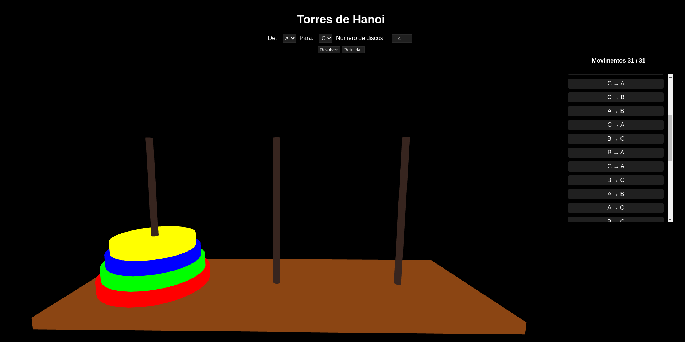

# Torres de Hanoi

**Conteúdo da Disciplina**: Dividir e conquistar 

## Alunos
| Matrícula   | Aluno                         |
| ----------- | ----------------------------- |
| 21/1039250  |  Arthur Grandão de Mello      |
| 21/1029540  |  Pedro Sena Barbosa Holtz Yen |

## Sobre 

O nosso projeto busca reproduzir o jogo Torres de Hanoi tridimensionalmente, mostrando a solução ótima com os passos necessários. 

## Screenshots

## Instalação 
**Linguagem**: Javascript  
**Framework**: Three.js (Biblioteca) 

## Uso 

O site está hospedado no github. Acesse o link abaixo:

[https://projeto-de-algoritmos-2024.github.io/D-C_TorresDeHanoi/](https://projeto-de-algoritmos-2024.github.io/D-C_TorresDeHanoi/)

## [Apresentação](https://youtu.be/JtQ99NgGnCs) 

